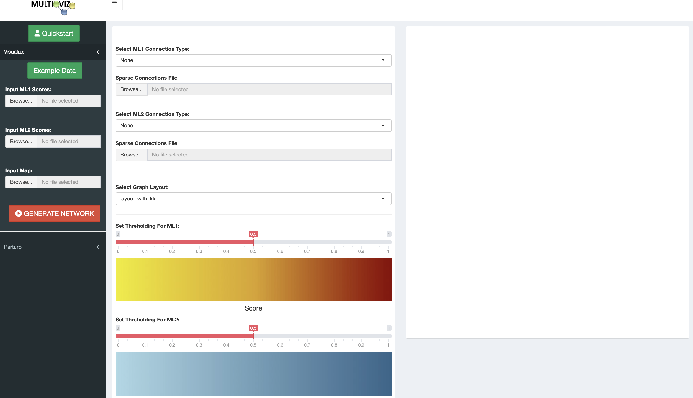
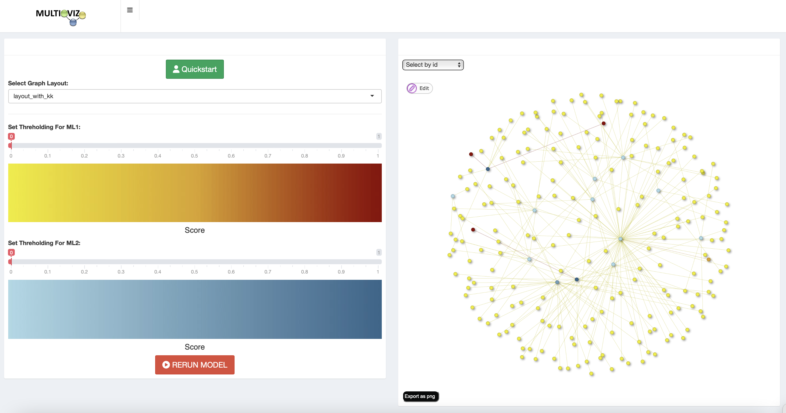

### multioviz: a platform for the interactive assessment of gene regulatory networks
##### Authors: Helen Xie, Lorin Crawford, Ashley Conard

## About the Project
Multioviz is a user-friendly R Shiny application that facilitates in-silico hypothesis testing by combining computational inference of gene regulatory network architectures with interactive visualization and perturbation. To generate a perturbable network, users can input either individual or population level multiomics data in addition to corresponding phenotypic data. Users can also directly visualize GRNs without perturbation by directly inputting ranked lists of molecular variables along with mapping data between molecular variables. We provide an R package version of Multioviz that allows programmers to integrate any machine learning method to rank and map enriched molecular variables, generalizing our platform to accept and model different genomic datasets at multiple molecular scales.

## Quickstart
- [here](#computational-method-integration-with-multioviz-r-package)
- [here](#perturbable-network-generation)
- [here](#direct-network-visualization)

## Built With
- R version 4.1.0
- R Shiny package
- visNetwork package

## Dependencies
- BANN (>= 0.1.0)
- shiny (>= 1.7.1)
- visNetwork (>= 2.1.0)
- igraph (>= 1.3.5)
- dplyr (>= 1.0.2
- shinyBS (>= 0.61)
- shinythemes (>= 1.2.0)
- shinydashboard (>= 0.7.2)
- shinydashboardPlus (>= 2.0.3)
- shinyWidgets (>= 0.7.4)
- shinyjs (>= 2.1.0)

## Direct network visualization
To faciliate in-silico hypothesis generation, multioviz allows users to visualize ranked lists and maps of molecular variables for a given phenotypic state as gene regulatory networks.




### Requirements to run
- ML1: a dataframe with columns for the 'id' and 'score' of each variable in molecular level 1
- ML2: a dataframe with columns for the 'id' and 'score' of each variable in molecular level 2
- map: a dataframe with 'from' and 'to' columns to map variables in ML1 to variables in ML2 


### Steps to run
1. In terminal, navigate to the multio-viz repository
2. Start a new R session
4. Load "shiny" package
5. Run app with following command: runApp('app/app.R')
6. Click on the visualization drop down the left panel
7. Input ML1, ML2, and map files for visualization
8. Select edge types for between molecular levels
9. Select graph layout
10. Set thresholding
11. Click "GENERATE"

## Perturbable network generation
##### To faciliate in-silico hypothesis testing, multioviz allows users to manually delete nodes and edges, and then rerun the ranking model to generate a new network with different significant molecular variables. 

### Requirements to run
- X: a N x J dimensional matrix where N is the number of patient samples and J is the size of the set of molecular variables for molecular level one
- y: a N-dimensional matrix of quantitative traits for a sample of patients
- mask: a J x G matrix of pre-defined annotations where J is the number of molecular variables for molecular level 1 and G is the number of molecular variables for molecular level 2


### Steps to run
1. In terminal, navigate to the multio-viz repository
2. Start a new R session
4. Load "shiny" package
5. Run app with following command: runApp('app/app.R')
6. Click on the perturbation drop down the left panel
7. Input X, y, and mask files for perturbation and select mathematical model (currently only BANNs is working)
8. Select edge types for between molecular levels
9. Select graph layout
10. Set thresholding
11. Click "RUN MODEL"


### Steps to perturb
1. Click "RUN MODEL" to visualize network


2. Select node(s) to delete and click "Edit"


3. Click "Delete selected to manually remove node"


4. Click "RERUN MODEL" to generate new network


5. Perturbed Network


## Computational method integration with "multioviz" R package 
The multioviz package contains a runMultioviz() function that allows users to connect the perturbation and visualization capabilities of the multioviz platform with their own ranking model. The function can take in 0 parameters to run the demo, 3 parameters runMultioviz(X, y, mask) to run user data with BANNs, and 4 parameters runMultioviz(X, y, mask, userScript) to run user data with user model.



### runMultioviz() function tutorial
1. Write script with a "runModel()" function that
    (a) Contains arguments for X, y, and mask
    (b) Runs your ranking model
    (c) Returns a list of length 3 with scores for two molecular levels and a mapping between nodes in ML1 and ML2

```

runModel <- function(X_input, y_input, mask_input) {

  res = BANN(X_input, mask_input, y_input, centered=FALSE, show_progress = TRUE)

  # convert method output to ranking and mapping dataframes 

  lst = list()
  lst$ML1 = ML1_pips
  lst$ML2 = ML2_pips
  lst$map = btw_ML_map
  return(lst)
}
```

2. Save X, y, and mask files as .rda files
3. In terminal, navigate to the multio-viz repository
4. Navigate to the multioviz subdirectory
5. Start a new R session
6. Install dependencies
7. Load "multioviz" package
8. Load in X, y, and mask matrices
9. Run app with runMultioviz(X, y, mask, userScript) function (userScript should be the file path string to your script from step 1)
10. Follow perturbation steps

```

> library(multioviz)
> userScript = "'path to your script'"
> load('path to X.rda file')
> load('path to y.rda file')
> load('path to mask.rda file')
> runMultioviz(X.rda, y.rda, mask.rda)
```


