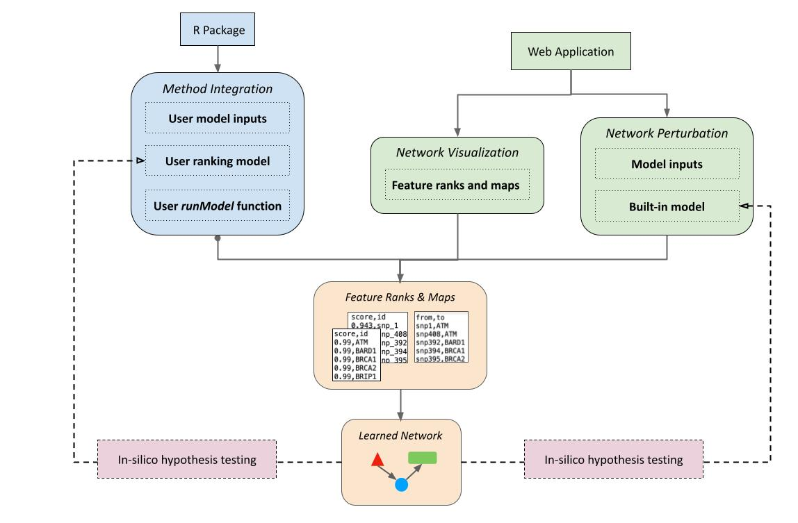
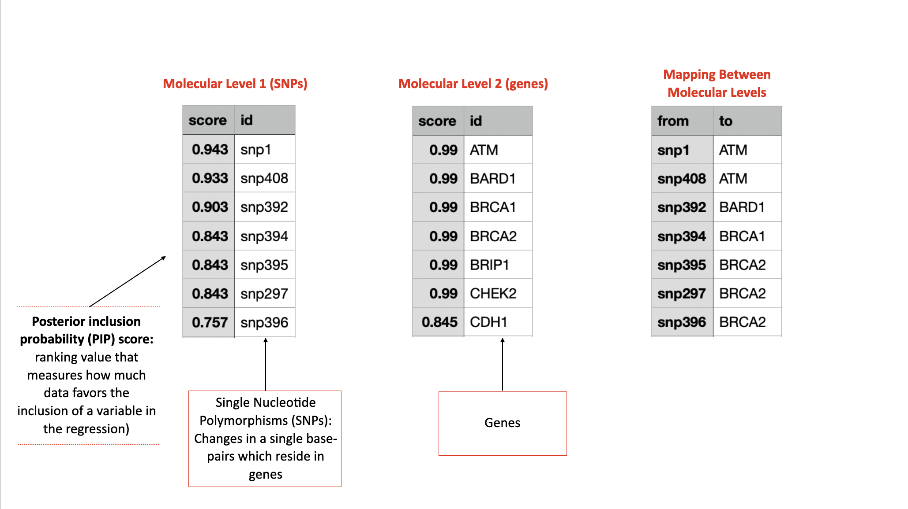
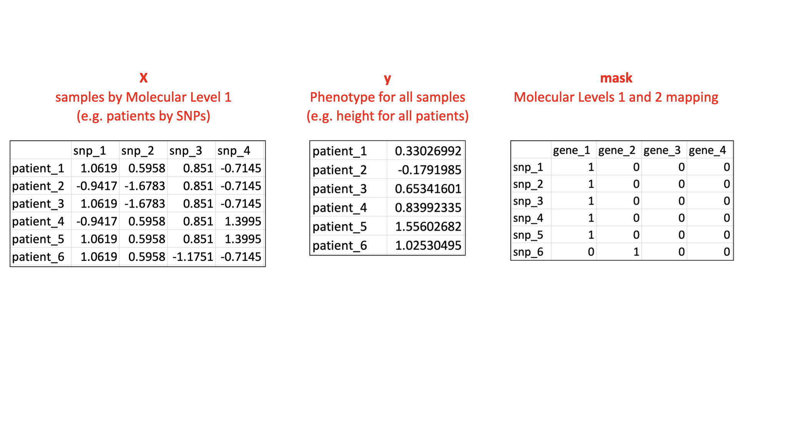
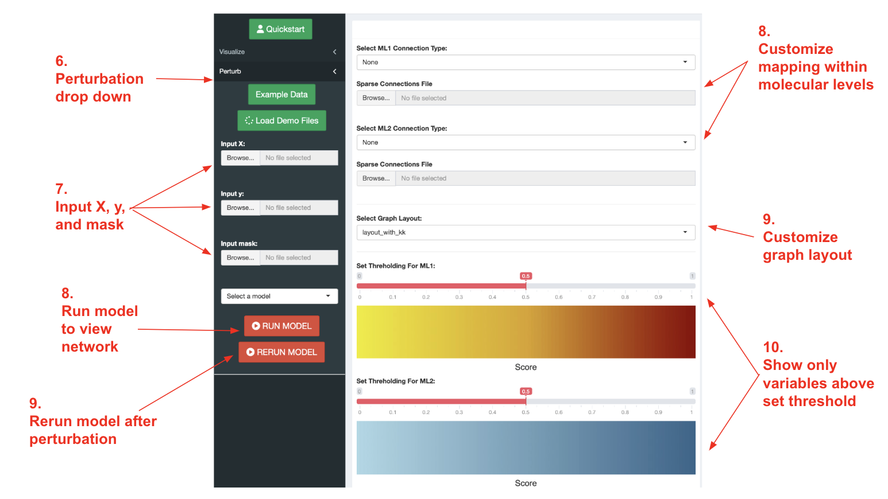
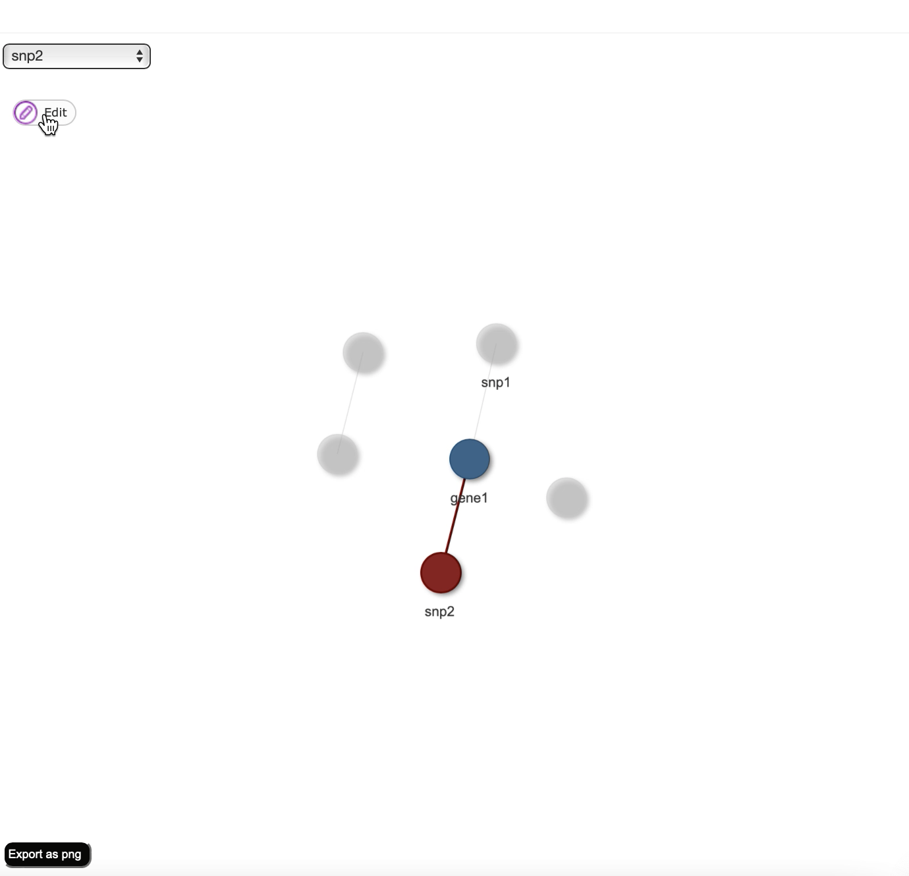
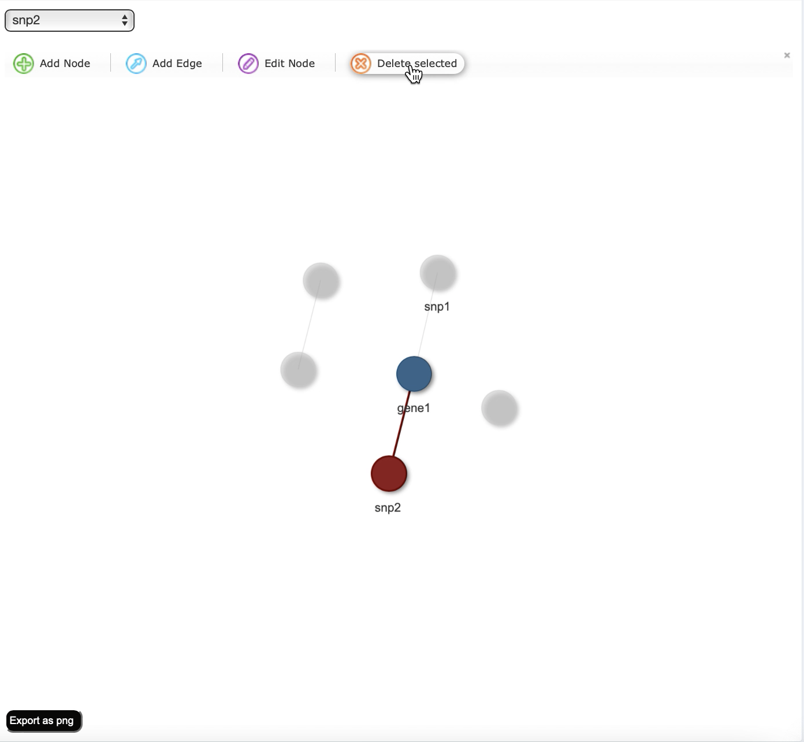
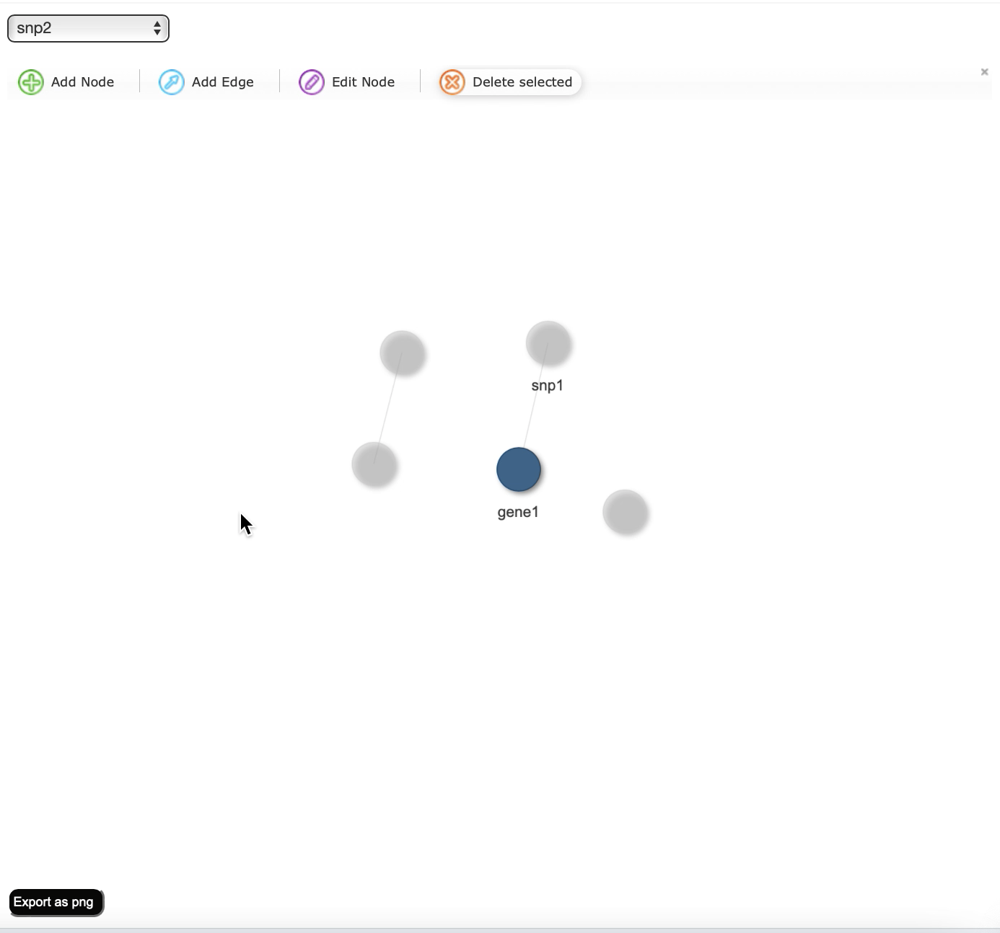
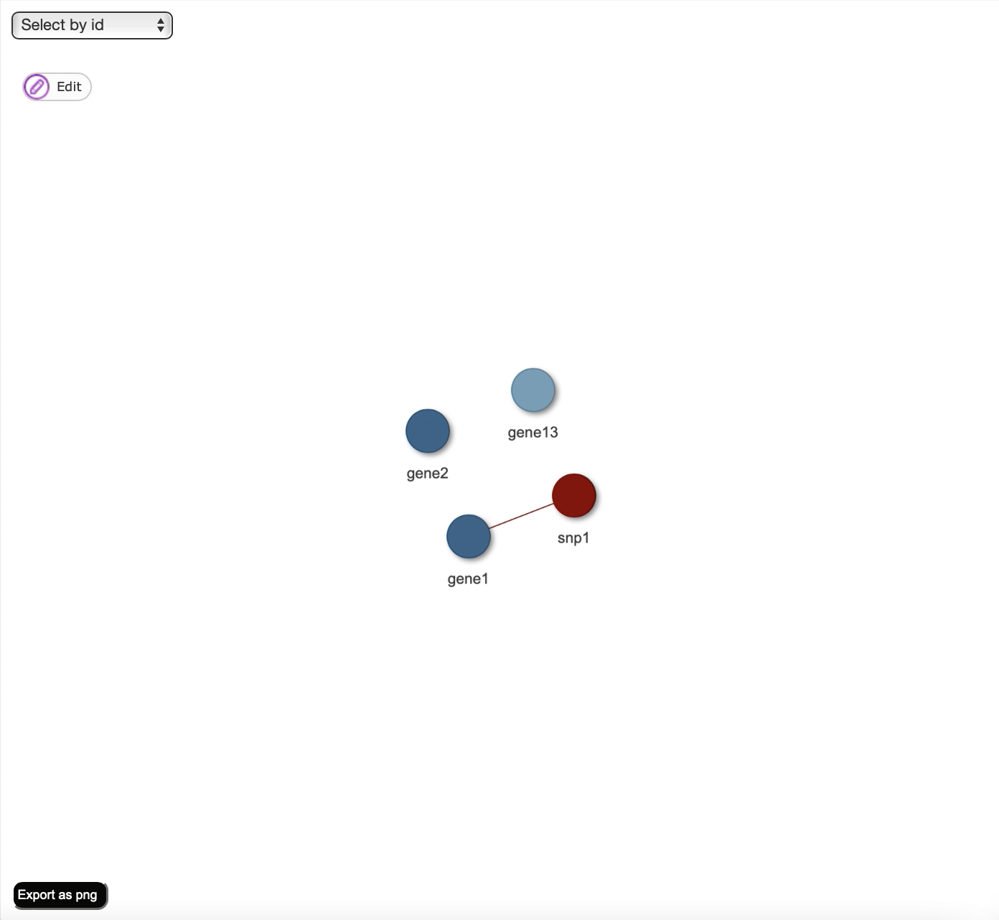
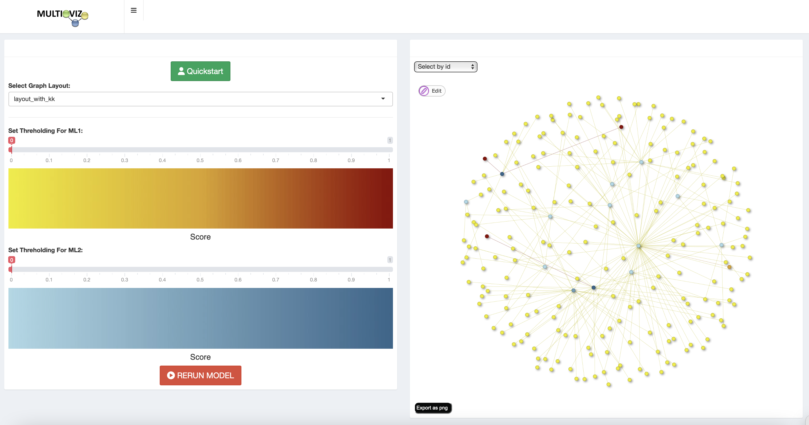

### multioviz: a platform for the interactive assessment of gene regulatory networks
##### Authors: Helen Xie, Lorin Crawford, Ashley Conard

## Outline
- [Introduction](#introduction)
- [Quickstart](#quickstart-3-usages)
- [Input Requirements](#input-requirements)
- [Visualize your ranked molecular variables as a GRN](#a-visualize-your-ranked-molecular-variables-as-a-grn)
- [Generate a perturbable GRN to test your hypotheses in-silico](#b-generate-a-perturbable-grn-to-test-your-hypotheses-in-silico)
- [Integrate your own computational method](#c-integrate-your-own-computational-method)


## Introduction
Multioviz is a user-friendly R Shiny application that facilitates in-silico hypothesis testing by combining computational inference of gene regulatory network (GRN) architectures with interactive visualization and perturbation. To generate a perturbable network, users can input either individual or population level multiomics data in addition to corresponding phenotypic data. Users can also directly visualize GRNs without perturbation by directly inputting ranked lists of molecular variables along with mapping data between molecular variables. We provide an R package version of Multioviz that allows programmers to integrate any machine learning method to rank and map enriched molecular variables, generalizing our platform to accept and model different genomic datasets at multiple molecular scales.



## Quickstart: 3 usages
Multioviz has three usages: To (1) visualize ranked molecular variables as GRNs or (2) perturb GRNs for in-silico hypothesis testing, visit [add link here for website]. To (3) Integrate your own computational method, install the multioviz R package ([see here for instructions](#steps-to-install-r-package)) 
1. For (1), under the "Visualize" drop down (side bar), upload the [required inputs](#a-visualize), set network preferences, and click "GENERATE NETWORK" to visualize your data. See the [visualization instructions](#a-visualize-your-ranked-molecular-variables-as-a-grn) for a detailed walk through.
2. For (2), under the "Perturb" drown down (side bar), upload the [required inputs](#b-perturb), and click "RUN MODEL" to generate the network. For a detailed walk through on how to perturb and rerun your network, visit the [Generate a Perturbable Network](#b-generate-a-perturbable-grn-to-test-your-hypotheses-in-silico) section.
3. For (3), open a new R session (```$ R```) and load the multioviz package (```> library multioviz```). Run ```runMultioviz()``` with no arguments to generate a demo network, and with the [required arguments](#c-integrate-computational-method) to generate a network using your own method. Visit the [Integrate your own computational method](#c-integrate-your-own-computational-method) section for more detailed instructions


## Dependencies
- R (>= 4.1.0)
- BANN (>= 0.1.0)
- shiny (>= 1.7.1)
- visNetwork (>= 2.1.0)
- igraph (>= 1.3.5)
- dplyr (>= 1.0.2)
- shinyBS (>= 0.61)
- shinythemes (>= 1.2.0)
- shinydashboard (>= 0.7.2)
- shinydashboardPlus (>= 2.0.3)
- shinyWidgets (>= 0.7.4)
- shinyjs (>= 2.1.0)

## Input Requirements
### A. Visualize
- Molecular Level 1 (ML1): a dataframe with columns for the 'id' and 'score' of each variable in molecular level 1
- Molecular Level 2 (ML2): a dataframe with columns for the 'id' and 'score' of each variable in molecular level 2
- Map: a dataframe with 'from' and 'to' columns to map variables in ML1 to variables in ML2 



### B. Perturb
- X: a N x J dimensional matrix where N is the number of patient samples and J is the size of the set of molecular variables for molecular level one
- y: a N-dimensional matrix of quantitative traits for a sample of patients
- mask: a J x G matrix of pre-defined annotations where J is the number of molecular variables for molecular level 1 and G is the number of molecular variables for molecular level 2



### C. Integrate computational method
- M: Computational method that ranks molecular features
- I: Required input datasets for computational method
- Script with runModel() function that has parameters for I and that outputs ML1, ML2, and Map

## A. Visualize your ranked molecular variables as a GRN
To faciliate in-silico hypothesis generation, multioviz allows users to visualize ranked lists and maps of molecular variables for a given phenotypic state as gene regulatory networks.

### Steps to run
1. In terminal, navigate to the multio-viz repository ```$ cd .../multio-viz```
2. Start a new R session ```$ R```
4. Load "shiny" package ``` > library shiny```
5. Run app with following command: ```> runApp('app/app.R')```
6. Click on the visualization drop down (side bar)

7. Input ML1, ML2, and map files for visualization

8. Select edge types for between molecular levels

9. Select graph layout

10. Set thresholding

11. Click "GENERATE NETWORK"

## B. Generate a perturbable GRN to test your hypotheses in-silico
##### To faciliate in-silico hypothesis testing, multioviz allows users to manually delete nodes and edges, and then rerun the ranking model to generate a new network with different significant molecular variables. 



### Steps to run
1. In terminal, navigate to the multio-viz repository ```$ cd .../multioviz```
2. Start a new R session ```$ R```
4. Load "shiny" package ```> library(shiny)```
5. Run app with following command: ```> runApp('app/app.R')```
6. Click on the perturbation drop down the left panel

7. Input X, y, and mask files for perturbation and select mathematical model (currently only BANNs is working)

8. Select edge types for between molecular levels

9. Select graph layout

10. Set thresholding

11. Click "RUN MODEL" to visualize network


2. Select node(s) to delete and click "Edit"


3. Click "Delete selected to manually remove node"


4. Click "RERUN MODEL" to generate new network


5. Perturbed Network


## C. Integrate your own computational method
The multioviz package contains a runMultioviz() function that allows users to connect the perturbation and visualization capabilities of the multioviz platform with their own ranking model. The function can take in 0 parameters to run the demo, 3 parameters ```runMultioviz(X, y, mask)``` to run user data with BANNs, and 4 parameters ```runMultioviz(X, y, mask, userScript)``` to run user data with user model.

### Steps to Install "multioviz" R package
1. In terminal, navigate to the multio-viz repository 
2. Navigate to the multioviz subdirectory
```
$ cd ../multio-viz/multioviz
```
3. Start a new R session 
```
$ R
```
4. Install dependencies 
```
> install.packages("shiny")
> install.packages("visNetwork")
> install.packages("igraph")
...
```
5. Install and load the "multioviz" package
```
> install.packages("shiny")
> library(multioviz)
```


### runMultioviz() function tutorial
1. Write script with a "runModel()" function that
    (a) Contains arguments for X, y, and mask
    (b) Runs your ranking model
    (c) Returns a list of length 3 with scores for two molecular levels and a mapping between nodes in ML1 and ML2

```

runModel <- function(X_input, y_input, mask_input) {

  res = BANN(X_input, mask_input, y_input, centered=FALSE, show_progress = TRUE)

  # convert method output to ranking and mapping dataframes 

  lst = list()
  lst$ML1 = ML1_pips
  lst$ML2 = ML2_pips
  lst$map = btw_ML_map
  return(lst)
}
```

2. Save X, y, and mask files as .rda files
3. Load in X, y, and mask matrices
```
> load('path to X.rda file')
> load('path to y.rda file')
> load('path to mask.rda file')
```
4. Save path to your script as a variable
```
> userScript = "'path to your script'"
```
5. Run app with runMultioviz(X, y, mask, userScript) function
```
runMultioviz(X.rda, y.rda, mask.rda)
```
6. Follow perturbation steps from the [section above](#generate-a-perturbable-grn-to-test-your-hypotheses-in-silico)


