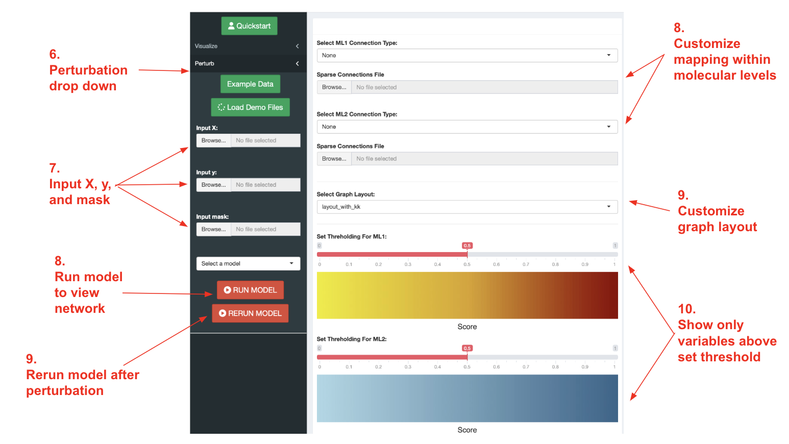
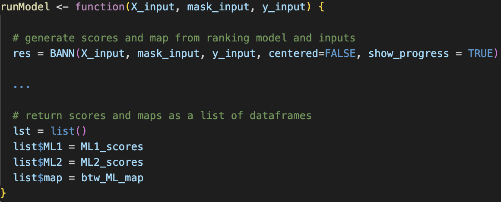
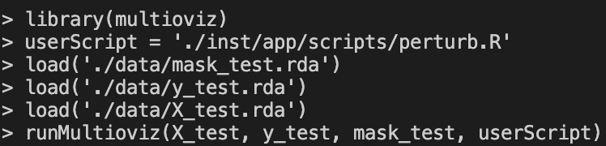
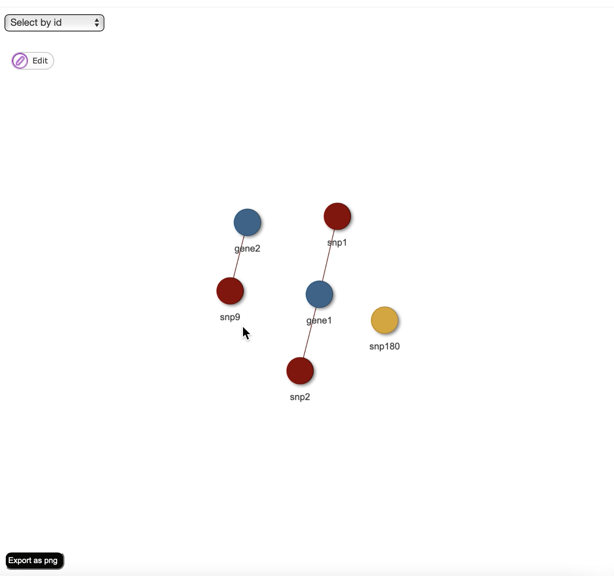
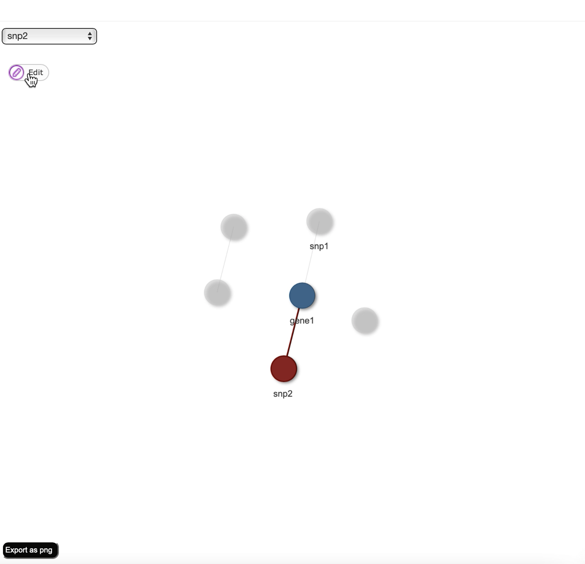
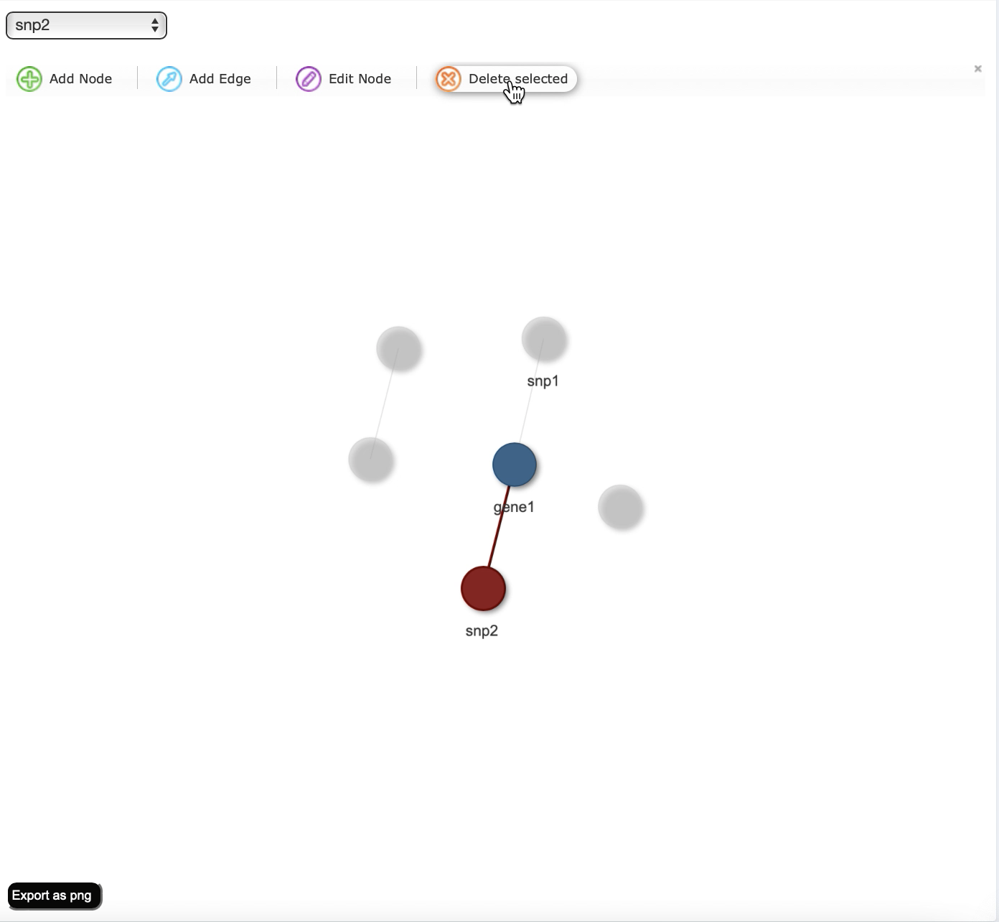
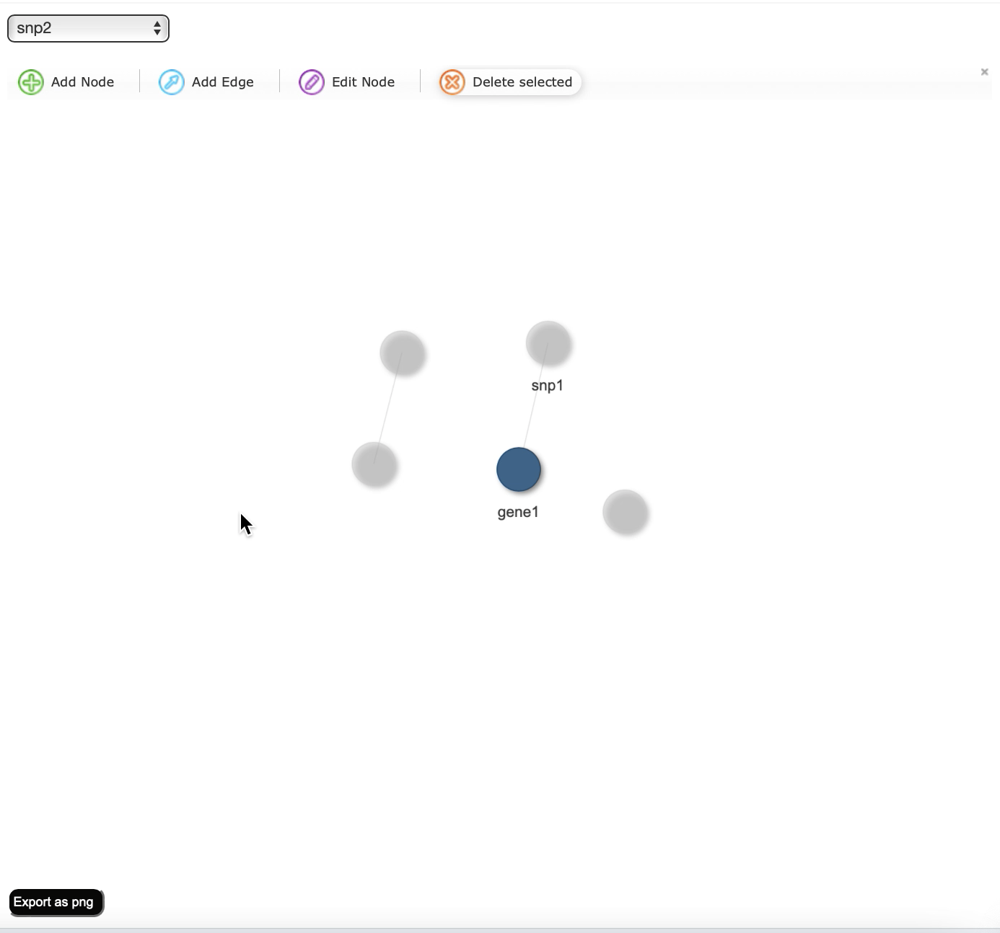
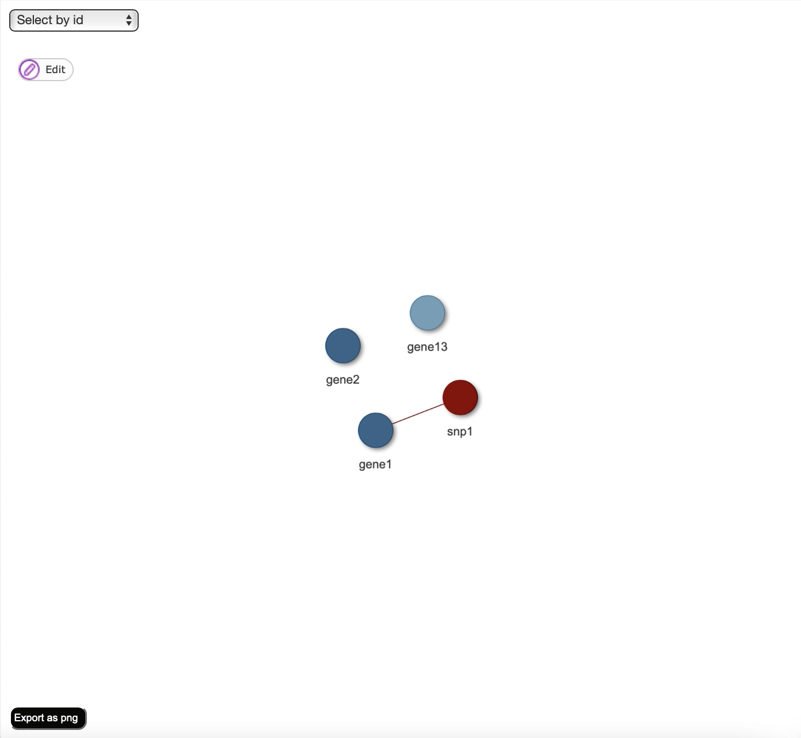

# Multi-omics Gene Regulatory Network Interactive Visualization
### Ashley Conard, Helen Xie, Lorin Crawford

## About the Project
Biological mechanisms that drive cellular development and function can be represented by complex networks of interactions between regulators, genes, and epigenetic factors known as gene regulatory networks (GRNs). Understanding the multi-omic landscapes of these mechanisms in both normal and dysregulated states is critical to discovering novel biomarkers and advancing treatment for diseases such as cancer. In-vitro experimental methods to identify significant genetic and epigenetic variables and their associations for traits of interest are both expensive and time-consuming, preventing researchers from testing each possible candidate variable for causality. While machine learning methods have been developed to infer GRN architectures by ranking variables across different -omic modalities, there is a gap between the high-dimensional ranked lists that these models output and interpretable visualizations that practitioners can use to generate and test biological hypotheses. To make the dissemination of such information accessible to end-users, we developed Multioviz: a user-friendly R Shiny application that facilitates in-silico hypothesis testing by combining computational inference of GRN architectures with interactive visualization and perturbation. We provide a corresponding  R package version of Multioviz that allows programmers to integrate any machine learning method to rank and map enriched molecular variables, generalizing our platform to accept and model different genomic datasets at multiple molecular scales.

## Built With
- R version 4.1.0
- R Shiny package
- visNetwork package

## Dependencies
- BANN (>= 0.1.0)
- shiny (>= 1.7.1)
- visNetwork (>= 2.1.0)
- igraph (>= 1.3.5)
- dplyr (>= 1.0.2
- shinyBS (>= 0.61)
- shinythemes (>= 1.2.0)
- shinydashboard (>= 0.7.2)
- shinydashboardPlus (>= 2.0.3)
- shinyWidgets (>= 0.7.4)
- shinyjs (>= 2.1.0)

## Web Application

### Requirements to run
- X: a N x J dimensional matrix where N is the number of patient samples and J is the size of the set of molecular variables for molecular level one
- y: a N-dimensional matrix of quantitative traits for a sample of patients
- mask: a J x G matrix of pre-defined annotations where J is the number of molecular variables for molecular level 1 and G is the number of molecular variables for molecular level 2

### Steps to run
1. In terminal, navigate to the multio-viz repository
2. Start a new R session
4. Load "shiny" package
5. Run app with following command: runApp('app/app.R')
6. Click on the perturbation drop down the left panel
7. Input X, y, and mask files for perturbation and select mathematical model (currently only BANNs is working)
8. Select edge types for between molecular levels
9. Select graph layout
10. Set thresholding
11. Click "RUN MODEL"

## R Package 
The multioviz package contains a runMultioviz() function that allows users to connect the perturbation and visualization capabilities with their own ranking model. The function  can take in 0 parameters to run the demo, 3 parameters runMultioviz(X, y, mask) to run user data with BANNs, and 4 parameters runMultioviz(X, y, mask, userScript) to run user data with user model.

### runMultioviz() function tutorial
1. Write script with a "runModel()" function that
    (a) Contains arguments for X, y, and mask
    (b) Runs your ranking model
    (c) Returns a list of length 3 with scores for two molecular levels and a mapping between nodes in ML1 and ML2

2. Save X, y, and mask files as .rda files
3. In terminal, navigate to the multio-viz repository
4. Navigate to the multioviz subdirectory
5. Start a new R session
6. Install dependencies
7. Load "multioviz" package
8. Load in X, y, and mask matrices
9. Run app with runMultioviz(X, y, mask, userScript) function (userScript should be the file path string to your script from step 1)

## Network Perturbation
To faciliate in-silico hypothesis testing, multioviz allows users to manually delete nodes and edges, and then rerun the ranking model to generate a new network with different significant molecular variables. 

### Steps
1. Click "RUN MODEL" to visualize network

2. Select node(s) to delete and click "Edit"

3. Click "Delete selected to manually remove node"

4. Click "RERUN MODEL" to generate new network

5. Perturbed Network

